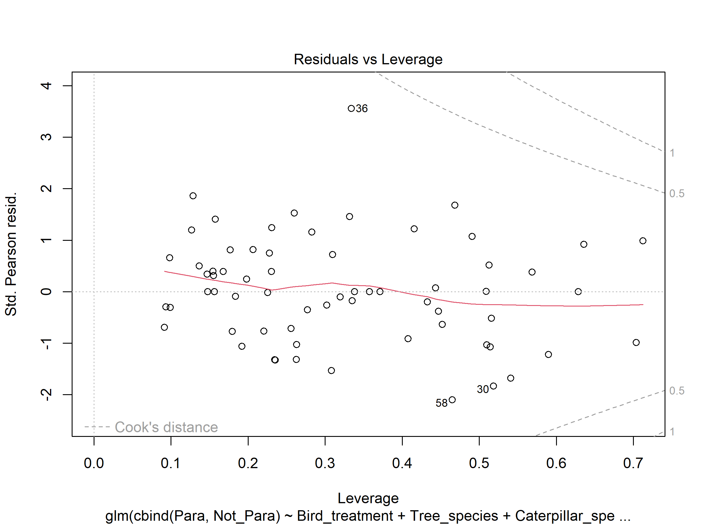
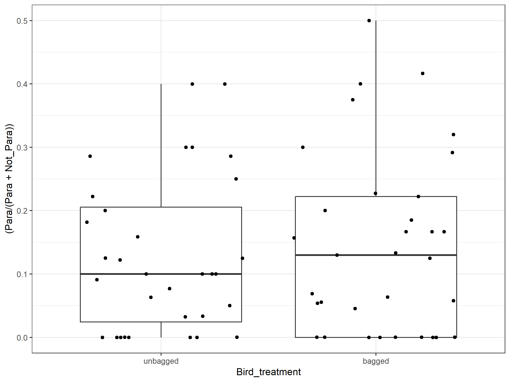
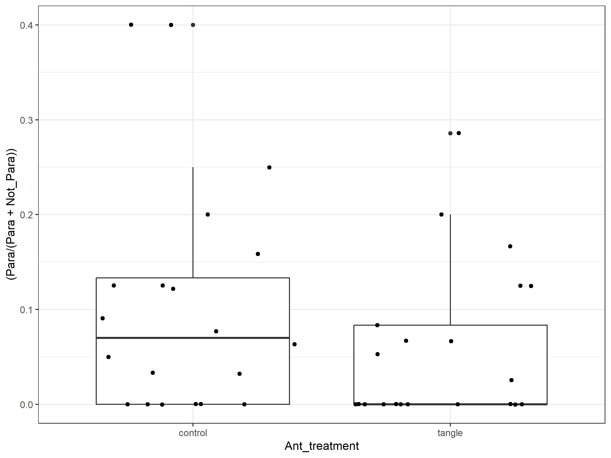

EFS drives enemy complementarity–interference
================
Riley M. Anderson & Nora C. Mitchell
September 19, 2023

¶

- <a href="#overview" id="toc-overview">Overview</a>
  - <a href="#summary-of-results" id="toc-summary-of-results">Summary of
    Results</a>
- <a href="#session-information" id="toc-session-information">Session
  Information</a>

## Overview

What is this analysis about?

### Summary of Results

- 

<!-- -->

    ## 
    ## Call:
    ## glm(formula = cbind(Para, Not_Para) ~ Bird_treatment + Tree_species + 
    ##     Caterpillar_species, family = quasibinomial(), data = bird)
    ## 
    ## Deviance Residuals: 
    ##      Min        1Q    Median        3Q       Max  
    ## -1.79472  -0.64104  -0.00021   0.54433   2.45002  
    ## 
    ## Coefficients:
    ##                                             Estimate Std. Error t value
    ## (Intercept)                                 -1.36652    0.35390  -3.861
    ## Bird_treatmentbagged                        -0.05635    0.15254  -0.369
    ## Tree_speciesBE                             -16.49602 2341.30742  -0.007
    ## Tree_speciesBI                              -0.02574    0.50449  -0.051
    ## Tree_speciesHI                               0.33480    0.30122   1.111
    ## Tree_speciesRM                               0.00731    0.42183   0.017
    ## Tree_speciesRO                               0.33975    0.32743   1.038
    ## Tree_speciesWH                              -0.03847    0.39064  -0.098
    ## Tree_speciesWO                              -1.06387    0.48278  -2.204
    ## Caterpillar_speciesEnnomos subsignaria      -1.33833    1.09837  -1.218
    ## Caterpillar_speciesHimella intractata       -0.28324    0.57736  -0.491
    ## Caterpillar_speciesLomographa glomeraria    -1.77808    1.07977  -1.647
    ## Caterpillar_speciesLomographa vestaliata    -0.10707    0.85650  -0.125
    ## Caterpillar_speciesLymantria dispar          0.09242    0.49197   0.188
    ## Caterpillar_speciesMelanolophia canadaria   -1.28803    0.32959  -3.908
    ## Caterpillar_speciesMorrisonia confusa       -2.11597    1.06907  -1.979
    ## Caterpillar_speciesNola triquetrana          1.23245    0.63431   1.943
    ## Caterpillar_speciesOrthosia rubescens       -0.06753    0.35460  -0.190
    ## Caterpillar_speciesPyrifera hesperidago     -1.08229    0.74927  -1.444
    ## Caterpillar_speciesSatyrium liparops       -18.34698 3251.16125  -0.006
    ## Caterpillar_speciesSperulanza pustularia    -0.39454    0.48794  -0.809
    ##                                           Pr(>|t|)    
    ## (Intercept)                               0.000366 ***
    ## Bird_treatmentbagged                      0.713565    
    ## Tree_speciesBE                            0.994410    
    ## Tree_speciesBI                            0.959537    
    ## Tree_speciesHI                            0.272397    
    ## Tree_speciesRM                            0.986252    
    ## Tree_speciesRO                            0.305121    
    ## Tree_speciesWH                            0.921997    
    ## Tree_speciesWO                            0.032830 *  
    ## Caterpillar_speciesEnnomos subsignaria    0.229537    
    ## Caterpillar_speciesHimella intractata     0.626161    
    ## Caterpillar_speciesLomographa glomeraria  0.106741    
    ## Caterpillar_speciesLomographa vestaliata  0.901083    
    ## Caterpillar_speciesLymantria dispar       0.851851    
    ## Caterpillar_speciesMelanolophia canadaria 0.000317 ***
    ## Caterpillar_speciesMorrisonia confusa     0.054064 .  
    ## Caterpillar_speciesNola triquetrana       0.058435 .  
    ## Caterpillar_speciesOrthosia rubescens     0.849832    
    ## Caterpillar_speciesPyrifera hesperidago   0.155694    
    ## Caterpillar_speciesSatyrium liparops      0.995523    
    ## Caterpillar_speciesSperulanza pustularia  0.423099    
    ## ---
    ## Signif. codes:  0 '***' 0.001 '**' 0.01 '*' 0.05 '.' 0.1 ' ' 1
    ## 
    ## (Dispersion parameter for quasibinomial family taken to be 1.003693)
    ## 
    ##     Null deviance: 138.437  on 64  degrees of freedom
    ## Residual deviance:  47.374  on 44  degrees of freedom
    ##   (1 observation deleted due to missingness)
    ## AIC: NA
    ## 
    ## Number of Fisher Scoring iterations: 17
    ##                                                  2.5 %       97.5 %
    ## (Intercept)                               -2.091216594  -0.69760774
    ## Bird_treatmentbagged                      -0.354242040   0.24433984
    ## Tree_speciesBE                                      NA 164.71461965
    ## Tree_speciesBI                            -1.097387021   0.90970181
    ## Tree_speciesHI                            -0.252847482   0.93337814
    ## Tree_speciesRM                            -0.857500710   0.81046765
    ## Tree_speciesRO                            -0.306295012   0.98346049
    ## Tree_speciesWH                            -0.832684518   0.71058211
    ## Tree_speciesWO                            -2.100517703  -0.17688546
    ## Caterpillar_speciesEnnomos subsignaria    -4.303036966   0.45348231
    ## Caterpillar_speciesHimella intractata     -1.504049462   0.79954134
    ## Caterpillar_speciesLomographa glomeraria  -4.724849136  -0.04446674
    ## Caterpillar_speciesLomographa vestaliata  -2.087456888   1.43066749
    ## Caterpillar_speciesLymantria dispar       -0.884602544   1.05610235
    ## Caterpillar_speciesMelanolophia canadaria -1.918986065  -0.61968283
    ## Caterpillar_speciesMorrisonia confusa     -5.052243287  -0.41508312
    ## Caterpillar_speciesNola triquetrana       -0.008392508   2.49271189
    ## Caterpillar_speciesOrthosia rubescens     -0.751281732   0.64545292
    ## Caterpillar_speciesPyrifera hesperidago   -2.714140995   0.30377619
    ## Caterpillar_speciesSatyrium liparops                NA 212.30205711
    ## Caterpillar_speciesSperulanza pustularia  -1.318554077   0.60261044
    ## [1] 0.6792735

<!-- --><!-- --><!-- --><!-- --><!-- -->

    ## 
    ## Call:
    ## glm(formula = cbind(T_Para, Not_T) ~ Bird_treatment + Tree_species + 
    ##     Caterpillar_species, family = quasibinomial(), data = bird)
    ## 
    ## Deviance Residuals: 
    ##      Min        1Q    Median        3Q       Max  
    ## -1.94589  -0.45319  -0.00007   0.20897   1.70516  
    ## 
    ## Coefficients:
    ##                                             Estimate Std. Error t value
    ## (Intercept)                                 -1.85296    0.39542  -4.686
    ## Bird_treatmentbagged                         0.09018    0.18668   0.483
    ## Tree_speciesBE                             -17.03891 4542.10479  -0.004
    ## Tree_speciesBI                              -1.47307    0.86951  -1.694
    ## Tree_speciesHI                              -0.79556    0.41341  -1.924
    ## Tree_speciesRM                              -0.54429    0.50746  -1.073
    ## Tree_speciesRO                              -0.21183    0.40091  -0.528
    ## Tree_speciesWH                              -0.48178    0.46858  -1.028
    ## Tree_speciesWO                              -2.49014    0.86744  -2.871
    ## Caterpillar_speciesEnnomos subsignaria       0.20469    0.94998   0.215
    ## Caterpillar_speciesHimella intractata        0.42899    0.61440   0.698
    ## Caterpillar_speciesLomographa glomeraria   -20.50494 6828.44982  -0.003
    ## Caterpillar_speciesLomographa vestaliata     0.29906    0.73914   0.405
    ## Caterpillar_speciesLymantria dispar        -20.71719 6665.97501  -0.003
    ## Caterpillar_speciesMelanolophia canadaria   -1.72536    0.43440  -3.972
    ## Caterpillar_speciesMorrisonia confusa      -18.39482 3615.77452  -0.005
    ## Caterpillar_speciesNola triquetrana        -19.82921 6959.99289  -0.003
    ## Caterpillar_speciesOrthosia rubescens       -0.03519    0.41011  -0.086
    ## Caterpillar_speciesPyrifera hesperidago     -1.37036    0.97843  -1.401
    ## Caterpillar_speciesSatyrium liparops       -19.92267 7146.59230  -0.003
    ## Caterpillar_speciesSperulanza pustularia     0.00627    0.58225   0.011
    ##                                           Pr(>|t|)    
    ## (Intercept)                               2.93e-05 ***
    ## Bird_treatmentbagged                      0.631559    
    ## Tree_speciesBE                            0.997025    
    ## Tree_speciesBI                            0.097643 .  
    ## Tree_speciesHI                            0.061096 .  
    ## Tree_speciesRM                            0.289589    
    ## Tree_speciesRO                            0.600023    
    ## Tree_speciesWH                            0.309764    
    ## Tree_speciesWO                            0.006390 ** 
    ## Caterpillar_speciesEnnomos subsignaria    0.830443    
    ## Caterpillar_speciesHimella intractata     0.488885    
    ## Caterpillar_speciesLomographa glomeraria  0.997618    
    ## Caterpillar_speciesLomographa vestaliata  0.687826    
    ## Caterpillar_speciesLymantria dispar       0.997535    
    ## Caterpillar_speciesMelanolophia canadaria 0.000274 ***
    ## Caterpillar_speciesMorrisonia confusa     0.995965    
    ## Caterpillar_speciesNola triquetrana       0.997740    
    ## Caterpillar_speciesOrthosia rubescens     0.932034    
    ## Caterpillar_speciesPyrifera hesperidago   0.168685    
    ## Caterpillar_speciesSatyrium liparops      0.997789    
    ## Caterpillar_speciesSperulanza pustularia  0.991459    
    ## ---
    ## Signif. codes:  0 '***' 0.001 '**' 0.01 '*' 0.05 '.' 0.1 ' ' 1
    ## 
    ## (Dispersion parameter for quasibinomial family taken to be 0.6529555)
    ## 
    ##     Null deviance: 103.406  on 62  degrees of freedom
    ## Residual deviance:  31.015  on 42  degrees of freedom
    ##   (3 observations deleted due to missingness)
    ## AIC: NA
    ## 
    ## Number of Fisher Scoring iterations: 19
    ##                                                   2.5 %        97.5 %
    ## (Intercept)                                  -2.6807878  -1.120114085
    ## Bird_treatmentbagged                         -0.2736613   0.459479650
    ## Tree_speciesBE                             -875.2010552 234.668869542
    ## Tree_speciesBI                               -3.6775597  -0.034375880
    ## Tree_speciesHI                               -1.6360228   0.001393146
    ## Tree_speciesRM                               -1.6136481   0.406959381
    ## Tree_speciesRO                               -1.0147933   0.568972929
    ## Tree_speciesWH                               -1.4521444   0.408665315
    ## Tree_speciesWO                               -4.6936085  -1.062659193
    ## Caterpillar_speciesEnnomos subsignaria       -2.0926081   1.870701813
    ## Caterpillar_speciesHimella intractata        -0.8642276   1.593910816
    ## Caterpillar_speciesLomographa glomeraria  -2759.2221065 213.609544429
    ## Caterpillar_speciesLomographa vestaliata     -1.3049137   1.676229952
    ## Caterpillar_speciesLymantria dispar       -2588.5839290 227.107172308
    ## Caterpillar_speciesMelanolophia canadaria    -2.5704295  -0.851224772
    ## Caterpillar_speciesMorrisonia confusa     -1390.9560849 119.735352805
    ## Caterpillar_speciesNola triquetrana       -2851.4808686 211.465929961
    ## Caterpillar_speciesOrthosia rubescens        -0.8216433   0.800018436
    ## Caterpillar_speciesPyrifera hesperidago      -3.7029142   0.367428602
    ## Caterpillar_speciesSatyrium liparops      -2924.7882285 218.066763931
    ## Caterpillar_speciesSperulanza pustularia     -1.0791014   1.222337567
    ## [1] 0.6521706

<!-- --><!-- --><!-- --><!-- --><!-- -->

    ## 
    ## Call:
    ## glm(formula = cbind(H_Para, Not_H) ~ Bird_treatment + Tree_species + 
    ##     Caterpillar_species, family = quasibinomial(), data = bird)
    ## 
    ## Deviance Residuals: 
    ##      Min        1Q    Median        3Q       Max  
    ## -1.82744  -0.71171  -0.00012   0.38670   1.79478  
    ## 
    ## Coefficients:
    ##                                             Estimate Std. Error t value
    ## (Intercept)                                 -2.51066    0.50952  -4.928
    ## Bird_treatmentbagged                        -0.19996    0.20347  -0.983
    ## Tree_speciesBE                             -16.76292 3800.15635  -0.004
    ## Tree_speciesBI                               0.80543    0.61255   1.315
    ## Tree_speciesHI                               1.02821    0.44180   2.327
    ## Tree_speciesRM                               0.50359    0.57745   0.872
    ## Tree_speciesRO                               0.91900    0.49390   1.861
    ## Tree_speciesWH                               0.36879    0.55173   0.668
    ## Tree_speciesWO                              -0.20736    0.59544  -0.348
    ## Caterpillar_speciesEnnomos subsignaria     -19.10304 5346.30786  -0.004
    ## Caterpillar_speciesHimella intractata       -0.79382    0.81003  -0.980
    ## Caterpillar_speciesLomographa glomeraria    -0.55187    1.12245  -0.492
    ## Caterpillar_speciesLomographa vestaliata   -17.99833 5398.97069  -0.003
    ## Caterpillar_speciesLymantria dispar          0.74515    0.54922   1.357
    ## Caterpillar_speciesMelanolophia canadaria   -0.82023    0.41800  -1.962
    ## Caterpillar_speciesMorrisonia confusa       -1.61294    1.07779  -1.497
    ## Caterpillar_speciesNola triquetrana          2.04068    0.71108   2.870
    ## Caterpillar_speciesOrthosia rubescens       -0.04413    0.44012  -0.100
    ## Caterpillar_speciesPyrifera hesperidago     -0.71701    0.90582  -0.792
    ## Caterpillar_speciesSatyrium liparops       -18.14200 5251.95965  -0.003
    ## Caterpillar_speciesSperulanza pustularia    -0.67858    0.60765  -1.117
    ##                                           Pr(>|t|)    
    ## (Intercept)                               1.35e-05 ***
    ## Bird_treatmentbagged                        0.3313    
    ## Tree_speciesBE                              0.9965    
    ## Tree_speciesBI                              0.1957    
    ## Tree_speciesHI                              0.0248 *  
    ## Tree_speciesRM                              0.3881    
    ## Tree_speciesRO                              0.0698 .  
    ## Tree_speciesWH                              0.5075    
    ## Tree_speciesWO                              0.7294    
    ## Caterpillar_speciesEnnomos subsignaria      0.9972    
    ## Caterpillar_speciesHimella intractata       0.3327    
    ## Caterpillar_speciesLomographa glomeraria    0.6255    
    ## Caterpillar_speciesLomographa vestaliata    0.9974    
    ## Caterpillar_speciesLymantria dispar         0.1821    
    ## Caterpillar_speciesMelanolophia canadaria   0.0564 .  
    ## Caterpillar_speciesMorrisonia confusa       0.1420    
    ## Caterpillar_speciesNola triquetrana         0.0064 ** 
    ## Caterpillar_speciesOrthosia rubescens       0.9206    
    ## Caterpillar_speciesPyrifera hesperidago     0.4331    
    ## Caterpillar_speciesSatyrium liparops        0.9973    
    ## Caterpillar_speciesSperulanza pustularia    0.2705    
    ## ---
    ## Signif. codes:  0 '***' 0.001 '**' 0.01 '*' 0.05 '.' 0.1 ' ' 1
    ## 
    ## (Dispersion parameter for quasibinomial family taken to be 0.9731117)
    ## 
    ##     Null deviance: 112.443  on 62  degrees of freedom
    ## Residual deviance:  40.333  on 42  degrees of freedom
    ##   (3 observations deleted due to missingness)
    ## AIC: NA
    ## 
    ## Number of Fisher Scoring iterations: 18
    ##                                                   2.5 %        97.5 %
    ## (Intercept)                               -3.595458e+00 -1.582955e+00
    ## Bird_treatmentbagged                      -5.968819e-01  2.023291e-01
    ## Tree_speciesBE                            -1.601034e+03 -3.920637e+02
    ## Tree_speciesBI                            -4.543502e-01  1.999858e+00
    ## Tree_speciesHI                             2.090493e-01  1.965746e+00
    ## Tree_speciesRM                            -6.647059e-01  1.644632e+00
    ## Tree_speciesRO                            -2.998417e-02  1.935667e+00
    ## Tree_speciesWH                            -7.325540e-01  1.471194e+00
    ## Tree_speciesWO                            -1.438171e+00  9.528185e-01
    ## Caterpillar_speciesEnnomos subsignaria               NA  3.098336e+02
    ## Caterpillar_speciesHimella intractata     -2.693647e+00  6.397950e-01
    ## Caterpillar_speciesLomographa glomeraria  -3.494560e+00  1.345976e+00
    ## Caterpillar_speciesLomographa vestaliata  -2.448962e+03 -4.077930e+03
    ## Caterpillar_speciesLymantria dispar       -3.207280e-01  1.850175e+00
    ## Caterpillar_speciesMelanolophia canadaria -1.608233e+00  4.628934e-02
    ## Caterpillar_speciesMorrisonia confusa     -4.510553e+00  1.476041e-01
    ## Caterpillar_speciesNola triquetrana        6.712797e-01  3.476536e+00
    ## Caterpillar_speciesOrthosia rubescens     -8.846181e-01  8.572092e-01
    ## Caterpillar_speciesPyrifera hesperidago   -2.744284e+00  9.553485e-01
    ## Caterpillar_speciesSatyrium liparops      -2.233706e+03 -1.046625e+03
    ## Caterpillar_speciesSperulanza pustularia  -1.814878e+00  5.853947e-01
    ## [1] 0.6888866

<!-- --><!-- --><!-- --><!-- --><!-- -->

    ## 
    ## Call:
    ## glm(formula = cbind(Para, Not_Para) ~ Ant_treatment + Tree_species + 
    ##     Caterpillar_species, family = quasibinomial(), data = ant)
    ## 
    ## Deviance Residuals: 
    ##      Min        1Q    Median        3Q       Max  
    ## -1.40056  -0.70528  -0.00014   0.38695   1.69421  
    ## 
    ## Coefficients:
    ##                                             Estimate Std. Error t value
    ## (Intercept)                                 -2.55377    0.75984  -3.361
    ## Ant_treatmenttangle                         -0.86157    0.31429  -2.741
    ## Tree_speciesBE                             -17.05412 5932.15807  -0.003
    ## Tree_speciesHI                               0.92773    0.59517   1.559
    ## Tree_speciesRM                               0.41748    1.30847   0.319
    ## Tree_speciesRO                               0.07344    0.79352   0.093
    ## Tree_speciesWH                              -0.91050    1.19966  -0.759
    ## Tree_speciesWO                              -0.33502    0.92206  -0.363
    ## Caterpillar_speciesAcronicta hasta           0.71416    1.39136   0.513
    ## Caterpillar_speciesAcronicta ovata         -17.65775 5589.04886  -0.003
    ## Caterpillar_speciesHeterocampa guttavitta    1.30483    1.37721   0.947
    ## Caterpillar_speciesHimella intractata        0.64072    1.53658   0.417
    ## Caterpillar_speciesLomographa vestaliata     1.25370    1.13843   1.101
    ## Caterpillar_speciesMelanolophia canadaria   -0.19570    0.75223  -0.260
    ## Caterpillar_speciesMorrisonia confusa       -0.59600    1.12736  -0.529
    ## Caterpillar_speciesNola triquetrana          2.40449    1.45106   1.657
    ## Caterpillar_speciesOrgyia leucostigma      -17.40276 5823.52158  -0.003
    ## Caterpillar_speciesPyrifera hesperidago      1.79396    1.47084   1.220
    ## Caterpillar_speciesSperulanza pustularia     0.45103    1.42991   0.315
    ##                                           Pr(>|t|)   
    ## (Intercept)                                0.00282 **
    ## Ant_treatmenttangle                        0.01192 * 
    ## Tree_speciesBE                             0.99773   
    ## Tree_speciesHI                             0.13332   
    ## Tree_speciesRM                             0.75269   
    ## Tree_speciesRO                             0.92710   
    ## Tree_speciesWH                             0.45593   
    ## Tree_speciesWO                             0.71982   
    ## Caterpillar_speciesAcronicta hasta         0.61287   
    ## Caterpillar_speciesAcronicta ovata         0.99751   
    ## Caterpillar_speciesHeterocampa guttavitta  0.35370   
    ## Caterpillar_speciesHimella intractata      0.68074   
    ## Caterpillar_speciesLomographa vestaliata   0.28269   
    ## Caterpillar_speciesMelanolophia canadaria  0.79716   
    ## Caterpillar_speciesMorrisonia confusa      0.60233   
    ## Caterpillar_speciesNola triquetrana        0.11170   
    ## Caterpillar_speciesOrgyia leucostigma      0.99764   
    ## Caterpillar_speciesPyrifera hesperidago    0.23550   
    ## Caterpillar_speciesSperulanza pustularia   0.75541   
    ## ---
    ## Signif. codes:  0 '***' 0.001 '**' 0.01 '*' 0.05 '.' 0.1 ' ' 1
    ## 
    ## (Dispersion parameter for quasibinomial family taken to be 1.2116)
    ## 
    ##     Null deviance: 65.594  on 40  degrees of freedom
    ## Residual deviance: 22.910  on 22  degrees of freedom
    ##   (1 observation deleted due to missingness)
    ## AIC: NA
    ## 
    ## Number of Fisher Scoring iterations: 18
    ##                                                   2.5 %      97.5 %
    ## (Intercept)                                  -4.3135394  -1.2479762
    ## Ant_treatmenttangle                          -1.5118522  -0.2721274
    ## Tree_speciesBE                                       NA 348.3029097
    ## Tree_speciesHI                               -0.2435419   2.1368532
    ## Tree_speciesRM                               -3.0754013   2.6142716
    ## Tree_speciesRO                               -1.6920927   1.5562243
    ## Tree_speciesWH                               -4.2875678   1.0322269
    ## Tree_speciesWO                               -2.5333452   1.3097222
    ## Caterpillar_speciesAcronicta hasta           -2.8430926   3.2594750
    ## Caterpillar_speciesAcronicta ovata        -2320.9539045 188.0920950
    ## Caterpillar_speciesHeterocampa guttavitta    -1.4812477   4.1796747
    ## Caterpillar_speciesHimella intractata        -3.0726571   3.5437154
    ## Caterpillar_speciesLomographa vestaliata     -1.2042795   3.5159705
    ## Caterpillar_speciesMelanolophia canadaria    -1.5450304   1.5219812
    ## Caterpillar_speciesMorrisonia confusa        -3.0667281   1.6082085
    ## Caterpillar_speciesNola triquetrana          -0.1252558   6.0617958
    ## Caterpillar_speciesOrgyia leucostigma                NA 418.7436248
    ## Caterpillar_speciesPyrifera hesperidago      -0.8050751   5.4704240
    ## Caterpillar_speciesSperulanza pustularia     -1.9909231   4.0912068
    ## [1] 0.6855704

<!-- --><!-- --><!-- --><!-- --><!-- -->

    ## 
    ## Call:
    ## glm(formula = cbind(T_Para, Not_T) ~ Ant_treatment + Tree_species + 
    ##     Caterpillar_species, family = quasibinomial(), data = ant)
    ## 
    ## Deviance Residuals: 
    ##      Min        1Q    Median        3Q       Max  
    ## -1.58748  -0.04681  -0.00004   0.00000   1.24974  
    ## 
    ## Coefficients:
    ##                                             Estimate Std. Error t value
    ## (Intercept)                               -3.763e+00  9.235e-01  -4.074
    ## Ant_treatmenttangle                       -2.726e-01  2.817e-01  -0.968
    ## Tree_speciesBE                             9.320e-01  1.227e+04   0.000
    ## Tree_speciesHI                             6.720e-01  9.437e-01   0.712
    ## Tree_speciesRM                             1.852e+00  1.152e+00   1.608
    ## Tree_speciesRO                            -1.923e+01  1.451e+04  -0.001
    ## Tree_speciesWH                            -1.991e+01  9.996e+03  -0.002
    ## Tree_speciesWO                            -1.884e+01  6.128e+03  -0.003
    ## Caterpillar_speciesAcronicta hasta        -1.850e+01  1.565e+04  -0.001
    ## Caterpillar_speciesAcronicta ovata        -1.983e-01  1.220e+04   0.000
    ## Caterpillar_speciesHeterocampa guttavitta -3.207e-01  1.622e+04   0.000
    ## Caterpillar_speciesHimella intractata      2.093e+01  1.451e+04   0.001
    ## Caterpillar_speciesLomographa vestaliata   2.140e+00  1.064e+00   2.011
    ## Caterpillar_speciesMelanolophia canadaria -2.143e-01  9.312e-01  -0.230
    ## Caterpillar_speciesMorrisonia confusa     -1.964e+01  5.540e+03  -0.004
    ## Caterpillar_speciesNola triquetrana        2.052e+01  9.996e+03   0.002
    ## Caterpillar_speciesOrgyia leucostigma      5.087e-02  1.246e+04   0.000
    ## Caterpillar_speciesPyrifera hesperidago    2.114e+01  9.996e+03   0.002
    ## Caterpillar_speciesSperulanza pustularia  -5.169e-01  1.233e+00  -0.419
    ##                                           Pr(>|t|)    
    ## (Intercept)                               0.000789 ***
    ## Ant_treatmenttangle                       0.346829    
    ## Tree_speciesBE                            0.999940    
    ## Tree_speciesHI                            0.486057    
    ## Tree_speciesRM                            0.126231    
    ## Tree_speciesRO                            0.998958    
    ## Tree_speciesWH                            0.998434    
    ## Tree_speciesWO                            0.997583    
    ## Caterpillar_speciesAcronicta hasta        0.999070    
    ## Caterpillar_speciesAcronicta ovata        0.999987    
    ## Caterpillar_speciesHeterocampa guttavitta 0.999984    
    ## Caterpillar_speciesHimella intractata     0.998866    
    ## Caterpillar_speciesLomographa vestaliata  0.060506 .  
    ## Caterpillar_speciesMelanolophia canadaria 0.820779    
    ## Caterpillar_speciesMorrisonia confusa     0.997213    
    ## Caterpillar_speciesNola triquetrana       0.998386    
    ## Caterpillar_speciesOrgyia leucostigma     0.999997    
    ## Caterpillar_speciesPyrifera hesperidago   0.998338    
    ## Caterpillar_speciesSperulanza pustularia  0.680312    
    ## ---
    ## Signif. codes:  0 '***' 0.001 '**' 0.01 '*' 0.05 '.' 0.1 ' ' 1
    ## 
    ## (Dispersion parameter for quasibinomial family taken to be 0.5428377)
    ## 
    ##     Null deviance: 42.712  on 35  degrees of freedom
    ## Residual deviance: 10.619  on 17  degrees of freedom
    ##   (6 observations deleted due to missingness)
    ## AIC: NA
    ## 
    ## Number of Fisher Scoring iterations: 20
    ##                                                   2.5 %       97.5 %
    ## (Intercept)                                  -6.0377176   -2.2718108
    ## Ant_treatmenttangle                          -0.8464319    0.2634151
    ## Tree_speciesBE                             -513.8730812  464.8705531
    ## Tree_speciesHI                               -1.1200246    2.8044975
    ## Tree_speciesRM                               -0.5194601    4.2958438
    ## Tree_speciesRO                            -6078.5053330  543.7878845
    ## Tree_speciesWH                                       NA 1132.4203865
    ## Tree_speciesWO                                       NA  604.4890979
    ## Caterpillar_speciesAcronicta hasta                   NA 1254.2062538
    ## Caterpillar_speciesAcronicta ovata         -465.7978722  430.6193956
    ## Caterpillar_speciesHeterocampa guttavitta  -579.3010464  561.8708556
    ## Caterpillar_speciesHimella intractata     -1086.5576462           NA
    ## Caterpillar_speciesLomographa vestaliata      0.1912048    4.5761329
    ## Caterpillar_speciesMelanolophia canadaria    -1.9775184    1.9025650
    ## Caterpillar_speciesMorrisonia confusa                NA  494.6071575
    ## Caterpillar_speciesNola triquetrana        -908.7447470           NA
    ## Caterpillar_speciesOrgyia leucostigma      -291.5632031  243.3069458
    ## Caterpillar_speciesPyrifera hesperidago    -763.4371728           NA
    ## Caterpillar_speciesSperulanza pustularia     -2.7958878    2.1958471
    ## [1] 0.6303544

<!-- --><!-- --><!-- --><!-- --><!-- -->

    ## 
    ## Call:
    ## glm(formula = cbind(H_Para, Not_H) ~ Ant_treatment + Tree_species + 
    ##     Caterpillar_species, family = quasibinomial(), data = ant)
    ## 
    ## Deviance Residuals: 
    ##      Min        1Q    Median        3Q       Max  
    ## -1.40881  -0.27481  -0.00006  -0.00001   1.84487  
    ## 
    ## Coefficients:
    ##                                             Estimate Std. Error t value
    ## (Intercept)                                  -2.7869     1.2841  -2.170
    ## Ant_treatmenttangle                          -2.0943     0.7759  -2.699
    ## Tree_speciesBE                              -19.1503 16936.2714  -0.001
    ## Tree_speciesHI                                0.9146     1.5719   0.582
    ## Tree_speciesRM                              -18.9167 13150.9478  -0.001
    ## Tree_speciesRO                                2.7473     2.1202   1.296
    ## Tree_speciesWH                               -0.1708     2.0408  -0.084
    ## Tree_speciesWO                                0.1292     1.8456   0.070
    ## Caterpillar_speciesAcronicta hasta          -17.6553 25907.2292  -0.001
    ## Caterpillar_speciesAcronicta ovata          -19.5646 15764.4417  -0.001
    ## Caterpillar_speciesHeterocampa guttavitta     0.7118     2.0029   0.355
    ## Caterpillar_speciesHimella intractata       -21.7545 16865.1191  -0.001
    ## Caterpillar_speciesLomographa vestaliata    -19.1167 17080.7853  -0.001
    ## Caterpillar_speciesMelanolophia canadaria    -0.5052     1.2578  -0.402
    ## Caterpillar_speciesMorrisonia confusa         0.1130     1.4916   0.076
    ## Caterpillar_speciesNola triquetrana           2.1261     1.9093   1.114
    ## Caterpillar_speciesOrgyia leucostigma       -19.2804 16544.8771  -0.001
    ## Caterpillar_speciesPyrifera hesperidago       0.6095     1.9808   0.308
    ## Caterpillar_speciesSperulanza pustularia     19.1947 13150.9478   0.001
    ##                                           Pr(>|t|)  
    ## (Intercept)                                 0.0444 *
    ## Ant_treatmenttangle                         0.0152 *
    ## Tree_speciesBE                              0.9991  
    ## Tree_speciesHI                              0.5683  
    ## Tree_speciesRM                              0.9989  
    ## Tree_speciesRO                              0.2124  
    ## Tree_speciesWH                              0.9343  
    ## Tree_speciesWO                              0.9450  
    ## Caterpillar_speciesAcronicta hasta          0.9995  
    ## Caterpillar_speciesAcronicta ovata          0.9990  
    ## Caterpillar_speciesHeterocampa guttavitta   0.7267  
    ## Caterpillar_speciesHimella intractata       0.9990  
    ## Caterpillar_speciesLomographa vestaliata    0.9991  
    ## Caterpillar_speciesMelanolophia canadaria   0.6929  
    ## Caterpillar_speciesMorrisonia confusa       0.9405  
    ## Caterpillar_speciesNola triquetrana         0.2810  
    ## Caterpillar_speciesOrgyia leucostigma       0.9991  
    ## Caterpillar_speciesPyrifera hesperidago     0.7620  
    ## Caterpillar_speciesSperulanza pustularia    0.9989  
    ## ---
    ## Signif. codes:  0 '***' 0.001 '**' 0.01 '*' 0.05 '.' 0.1 ' ' 1
    ## 
    ## (Dispersion parameter for quasibinomial family taken to be 1.488089)
    ## 
    ##     Null deviance: 49.610  on 35  degrees of freedom
    ## Residual deviance: 12.591  on 17  degrees of freedom
    ##   (6 observations deleted due to missingness)
    ## AIC: NA
    ## 
    ## Number of Fisher Scoring iterations: 20
    ##                                                  2.5 %       97.5 %
    ## (Intercept)                                  -6.681528   -0.8660092
    ## Ant_treatmenttangle                          -3.974710   -0.7905131
    ## Tree_speciesBE                                      NA 1308.9866862
    ## Tree_speciesHI                               -1.931422    5.0558611
    ## Tree_speciesRM                                      NA 1096.3884821
    ## Tree_speciesRO                               -1.878356    7.5427828
    ## Tree_speciesWH                               -4.755143    4.4500547
    ## Tree_speciesWO                               -3.426109    4.5683982
    ## Caterpillar_speciesAcronicta hasta        -8085.102144 1477.2697060
    ## Caterpillar_speciesAcronicta ovata                  NA 1337.3326293
    ## Caterpillar_speciesHeterocampa guttavitta    -3.873758    4.7526845
    ## Caterpillar_speciesHimella intractata     -2856.763376  986.6517401
    ## Caterpillar_speciesLomographa vestaliata            NA 2487.1126601
    ## Caterpillar_speciesMelanolophia canadaria    -2.835520    2.3750697
    ## Caterpillar_speciesMorrisonia confusa        -2.942750    3.3539183
    ## Caterpillar_speciesNola triquetrana          -1.299078    6.7338108
    ## Caterpillar_speciesOrgyia leucostigma     -2812.024599  969.8091532
    ## Caterpillar_speciesPyrifera hesperidago      -3.145003    5.2696102
    ## Caterpillar_speciesSperulanza pustularia   -902.799194           NA
    ## [1] 0.8017712

<!-- --><!-- --><!-- --><!-- --><!-- -->

    ## # A tibble: 108 × 9
    ## # Groups:   Caterpillar_species, Tree_species [38]
    ##    Caterpillar_species Tree_species  Para Not_Para H_Para Not_H T_Para Not_T
    ##    <fct>               <fct>        <int>    <int>  <int> <int>  <int> <int>
    ##  1 Achatia distincta   BC               1       12      1    12      0    13
    ##  2 Achatia distincta   BC               3        5      1     7      2     6
    ##  3 Achatia distincta   HI               2        6      1     7      1     7
    ##  4 Achatia distincta   HI               5        7      4     8      1    11
    ##  5 Achatia distincta   RO               2        9      1    10      1    10
    ##  6 Achatia distincta   RO               3        7      1     9      2     8
    ##  7 Achatia distincta   WO               0        5      0     5      0     5
    ##  8 Achatia distincta   WO               0       11      0    11      0    11
    ##  9 Ennomos subsignaria HI               0        6      0     6      0     6
    ## 10 Ennomos subsignaria HI               1        5      0     6      1     5
    ## # ℹ 98 more rows
    ## # ℹ 1 more variable: total_para <int>
    ## [1] 314
    ## [1] 2511

## Session Information

    R version 4.2.3 (2023-03-15 ucrt)
    Platform: x86_64-w64-mingw32/x64 (64-bit)
    Running under: Windows 10 x64 (build 19045)

    Matrix products: default

    locale:
    [1] LC_COLLATE=English_United States.utf8 
    [2] LC_CTYPE=English_United States.utf8   
    [3] LC_MONETARY=English_United States.utf8
    [4] LC_NUMERIC=C                          
    [5] LC_TIME=English_United States.utf8    

    attached base packages:
    [1] stats     graphics  grDevices utils     datasets  methods   base     

    other attached packages:
     [1] rsq_2.5         cowplot_1.1.1   lubridate_1.9.2 forcats_1.0.0  
     [5] stringr_1.5.0   dplyr_1.1.1     purrr_1.0.1     readr_2.1.4    
     [9] tidyr_1.3.0     tibble_3.2.1    ggplot2_3.4.1   tidyverse_2.0.0

    loaded via a namespace (and not attached):
     [1] tidyselect_1.2.0 xfun_0.38        splines_4.2.3    lattice_0.20-45 
     [5] colorspace_2.1-0 vctrs_0.6.1      generics_0.1.3   htmltools_0.5.5 
     [9] yaml_2.3.7       utf8_1.2.3       rlang_1.1.0      pillar_1.9.0    
    [13] nloptr_2.0.3     glue_1.6.2       withr_2.5.0      lifecycle_1.0.3 
    [17] munsell_0.5.0    gtable_0.3.3     codetools_0.2-19 evaluate_0.20   
    [21] labeling_0.4.2   knitr_1.42       tzdb_0.3.0       fastmap_1.1.1   
    [25] fansi_1.0.4      highr_0.10       Rcpp_1.0.10      scales_1.2.1    
    [29] farver_2.1.1     lme4_1.1-32      Deriv_4.1.3      hms_1.1.3       
    [33] digest_0.6.31    stringi_1.7.12   grid_4.2.3       rprojroot_2.0.3 
    [37] cli_3.6.1        tools_4.2.3      magrittr_2.0.3   pkgconfig_2.0.3 
    [41] MASS_7.3-58.2    Matrix_1.6-1     timechange_0.2.0 minqa_1.2.5     
    [45] rmarkdown_2.21   rstudioapi_0.14  R6_2.5.1         boot_1.3-28.1   
    [49] nlme_3.1-162     compiler_4.2.3  
