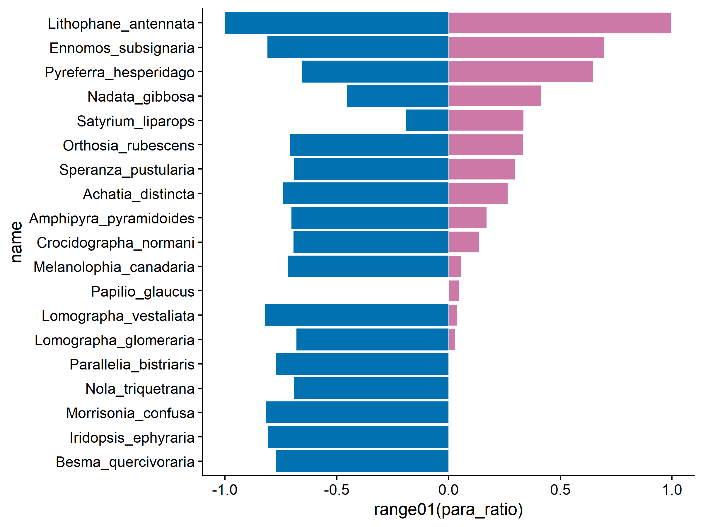

EFS drives enemy complementarity-Results
================
Riley M. Anderson & Nora C. Mitchell
September 19, 2023

¶

- <a href="#overview" id="toc-overview">Overview</a>
  - <a href="#summary-of-results" id="toc-summary-of-results">Summary of
    Results</a>
- <a href="#session-information" id="toc-session-information">Session
  Information</a>

## Overview

What is this analysis about?

### Summary of Results

- 

<!-- -->

<!-- -->

<!-- -->

<!-- -->

<!-- -->

<!-- -->

<!-- -->

## Session Information

    R version 4.2.3 (2023-03-15 ucrt)
    Platform: x86_64-w64-mingw32/x64 (64-bit)
    Running under: Windows 10 x64 (build 19045)

    Matrix products: default

    locale:
    [1] LC_COLLATE=English_United States.utf8 
    [2] LC_CTYPE=English_United States.utf8   
    [3] LC_MONETARY=English_United States.utf8
    [4] LC_NUMERIC=C                          
    [5] LC_TIME=English_United States.utf8    

    attached base packages:
    [1] stats     graphics  grDevices utils     datasets  methods   base     

    other attached packages:
     [1] cowplot_1.1.1   lubridate_1.9.2 forcats_1.0.0   stringr_1.5.0  
     [5] dplyr_1.1.1     purrr_1.0.1     readr_2.1.4     tidyr_1.3.0    
     [9] tibble_3.2.1    ggplot2_3.4.1   tidyverse_2.0.0

    loaded via a namespace (and not attached):
     [1] highr_0.10       pillar_1.9.0     compiler_4.2.3   tools_4.2.3     
     [5] digest_0.6.31    timechange_0.2.0 evaluate_0.20    lifecycle_1.0.3 
     [9] gtable_0.3.3     pkgconfig_2.0.3  rlang_1.1.0      cli_3.6.1       
    [13] rstudioapi_0.14  yaml_2.3.7       xfun_0.38        fastmap_1.1.1   
    [17] withr_2.5.0      knitr_1.42       generics_0.1.3   vctrs_0.6.1     
    [21] hms_1.1.3        rprojroot_2.0.3  grid_4.2.3       tidyselect_1.2.0
    [25] ggnewscale_0.4.9 glue_1.6.2       R6_2.5.1         fansi_1.0.4     
    [29] rmarkdown_2.21   farver_2.1.1     tzdb_0.3.0       magrittr_2.0.3  
    [33] codetools_0.2-19 scales_1.2.1     htmltools_0.5.5  colorspace_2.1-0
    [37] labeling_0.4.2   utf8_1.2.3       stringi_1.7.12   munsell_0.5.0   
